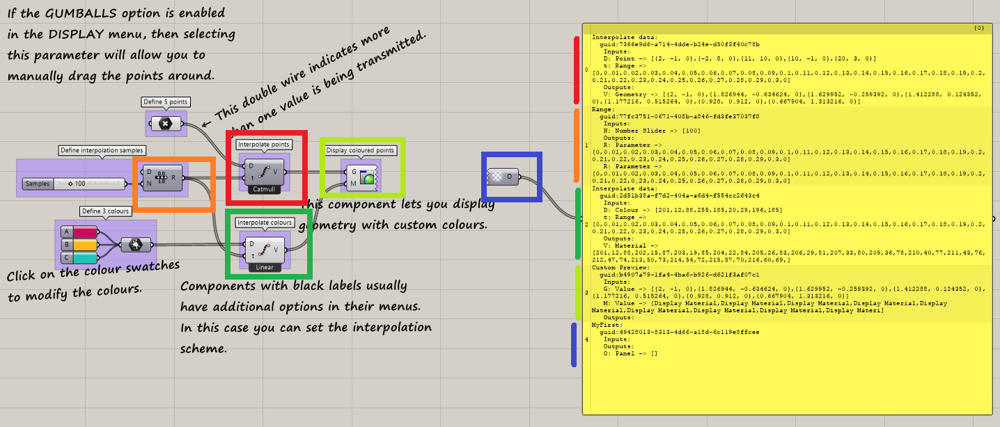

# GrashopperComponentLister

## Features

* For each component within the scene we fetch and display: `name`, `guid`, `Inputs`, `Ouputs`

## Flaws
* Only components get listed. Params such as Geometry, primitives and inputs are only seen by the values they pass.
* The result is only updated when a new component is added-to/deleted-from the scene, or when a click on an empty spot occurs. Not for instance when a new wire is connected.
* The parameters saved in the `ComponentParam` struct are all strings, no matter the original data type.